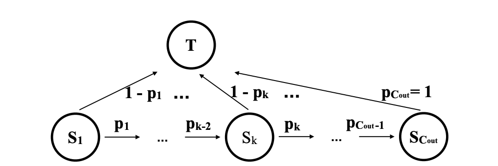
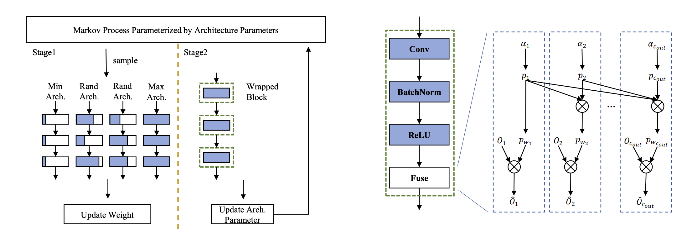

# [DMCP: Differentiable Markov Channel Pruning for Neural Networks](https://openaccess.thecvf.com/content_CVPR_2020/papers/Guo_DMCP_Differentiable_Markov_Channel_Pruning_for_Neural_Networks_CVPR_2020_paper.pdf)

[code](https://github.com/zx55/dmcp)

## 摘要

作者提出了一种**可微分的**基于**马尔可夫链**的通道剪枝方法

## 动机

1. 剪枝的搜索空间是冗余的：假设有五个通道, 剪枝第一个通道｜剪枝第二个通道最后得到的结果都是四个通道，剪枝结果相同
2. 通道存在对前置通道依赖：如果网络有12个通道，前提条件是拥有11个通道



> 结合这两点, 使用马尔可夫链是一个合理的方式

## 收获和思考

1. Budget Regularization(Sec 3.1.3)

> 马尔可夫链的训练参数(又名稀疏度相关参数)不仅在forward的时候发挥作用，可以使用可微分的FLOPs参数进行梯度优化

2. 左边这个单步sample训练

- 最小结构
- 最大结构(基准信息)
- 随机结构x2

参考代码可以看到最大结构的输出会被作为有点像：self-distillation的损失一样(有点trick)
```python
# https://github.com/zx55/dmcp/blob/a36a7f64b33ce93ef0f41f73166a01d29d6a1a5a/runner/us_runner.py#L203-L210
out = self.model(x)
if self.config.training.distillation.enable:
    if idx == 0:
        max_pred = out.detach()
        loss = criterion(out, y)
    else:
        loss = self.config.training.distillation.loss_weight * \
               distill_loss(out, max_pred)
        if self.config.training.distillation.hard_label:
            loss += criterion(out, y)
```


3. 只要能把结构参数和target损失结合起来, 其实网络结构、FLOPs都是可以微分的, 代码需要注意细节(debug)


## 附加材料

1. [LSP: Low-Power Semi-structured Pruning for Vision Transformers](https://openreview.net/forum?id=FoqZKsH9sE)同样也是将FLOPs作为微分的方式
2. [SDQ: Stochastic Differentiable Quantization with Mixed Precision](https://huangowen.github.io/SDQ/)将量化误差可微分的方式

