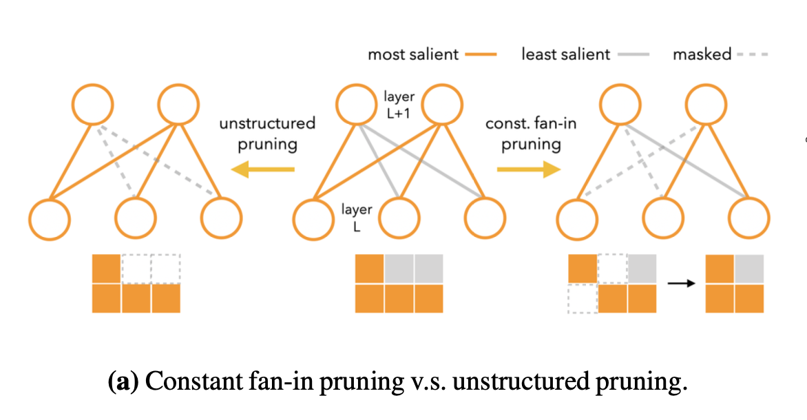
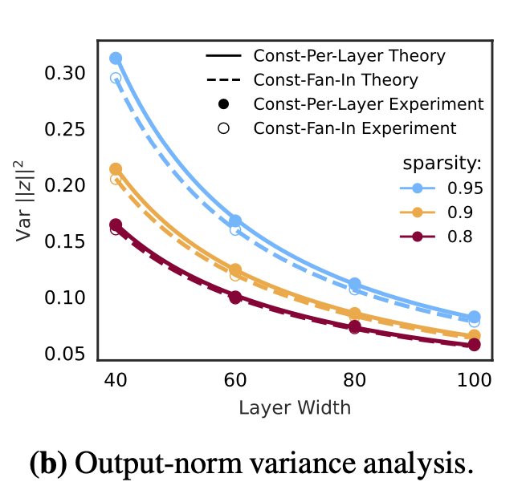
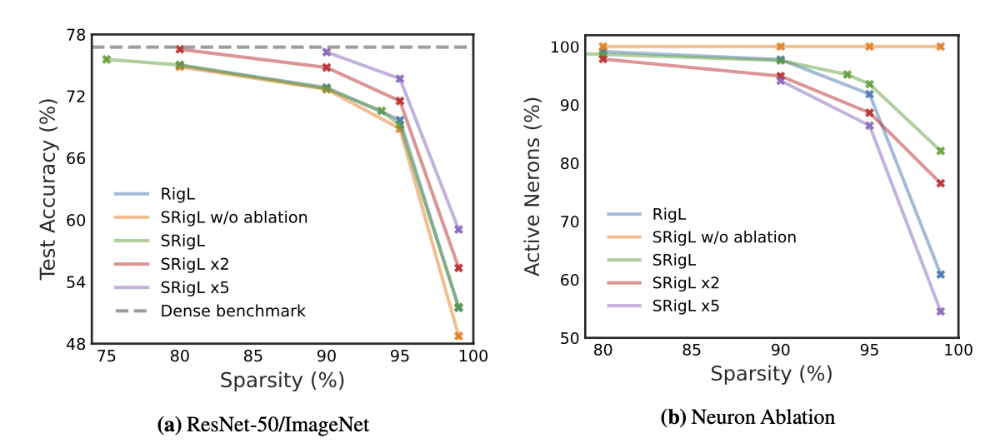

# [Dynamic Sparse Training with Structured Sparsity](https://openreview.net/forum?id=kOBkxFRKTA&noteId=KCZvgDQTBg)

[code](https://github.com/calgaryml/condensed-sparsity)

## 摘要

作者**优化**了一种**稀疏到稀疏**的动态训练方法

[Rigging the Lottery: Making All Tickets Winners](https://arxiv.org/abs/1911.11134)

> 为什么是优化?因为作者的SRigL方法是基于RigL改进的

## 动机

1. 作者整篇论文的motivation都是从constant fan-in开始的, 简单说：每个输出神经元连接等量的输入神经元

2. 方差分析: constant fan-in会带来方差更小的输出, 显著性随着稀疏度提升而提升, Sec3.1都在讲这个事情

3. Ablation的含义: 当剪枝率极高的时候, 为了保持特征增强网络泛华, 模型会选择性丢弃一定数量通道, 使得保留的通道权重可以多一些, 保留住有效特征的现象。
可以看到, 这种现象有利于SRigL保留较好的效果, 不然特征很高的情况下, 每个通道连接的神经元都极少, 非常伤害网络性能(结果可见)

## 收获和思考

1. 既然都有SRigL了, 是不是可以来一个SSRigL(fan_in和fan_out指不定都可以探索一下), 类似于T-Mask和Bi-Mask加速N:M反向传播的研究路线
   (学术意义＞工程意义)
2. 不愧是顶级的研究人员, 这么小一个点(constant fan-in)可以展开这么详细且solid的论文: 非常以小见大，85666的ICLR得分
3. 稀疏到稀疏的训练的效率的确值得怀疑, 感觉目前依然是更多的是理论上的

## 附加材料

1. [神经网络权重矩阵初始化的意义？
](https://www.zhihu.com/question/291032522/answer/2910097674)
2. [Learning N:M Fine-grained Structured Sparse Neural Networks From Scratch](https://arxiv.org/abs/2102.04010)
3. [Bi-directional Masks for Efficient N:M Sparse Training](https://arxiv.org/abs/2302.06058)
4. [Accelerated Sparse Neural Training: A Provable and Efficient Method to Find N:M Transposable Masks
](https://arxiv.org/abs/2102.08124)

