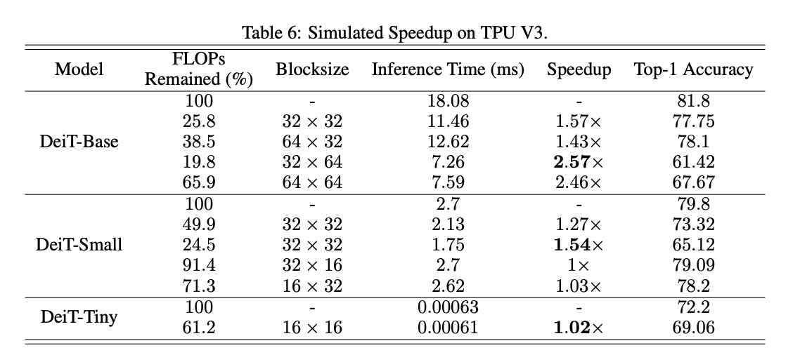

# [LSP: Low-Power Semi-structured Pruning for Vision Transformers](https://openreview.net/forum?id=FoqZKsH9sE)

[code]()

## 摘要

作者提出了一种**考虑功耗**的**半结构化稀疏Transformer（针对block稀疏）**

## 收获和思考

1. 

竟然可以用 FLOPs 来平替功耗？这个很扯

2. 稀疏在  TPU 和 GPU上的收益极其有限




3. [ViTA](https://arxiv.org/pdf/2302.09108.pdf)这个硬件的配置，这种稀疏模式在 RISC-V上的收益几乎是线性？看起来非常诱人。表格 Speedup 有些问题，主要看 Latency

```text
ViTA Results. ViTA Chen et al. (2024) is a novel DL acceleration platform based on RISC-V architecture with PEs (parallel exection) kernels supported in multiple blocksize configurations.
```


## 附加材料

1. [GPU上的Block Sparsity没有很明显的收益](https://developer.nvidia.com/blog/accelerating-matrix-multiplication-with-block-sparse-format-and-nvidia-tensor-cores/)
2. [Performance of structured sparsity for Inceptionv3 on A6000 GPU](https://github.com/NVIDIA/TensorRT/issues/2310)
3. [Fast Block Sparse Matrices for Pytorch](https://github.com/huggingface/pytorch_block_sparse)


