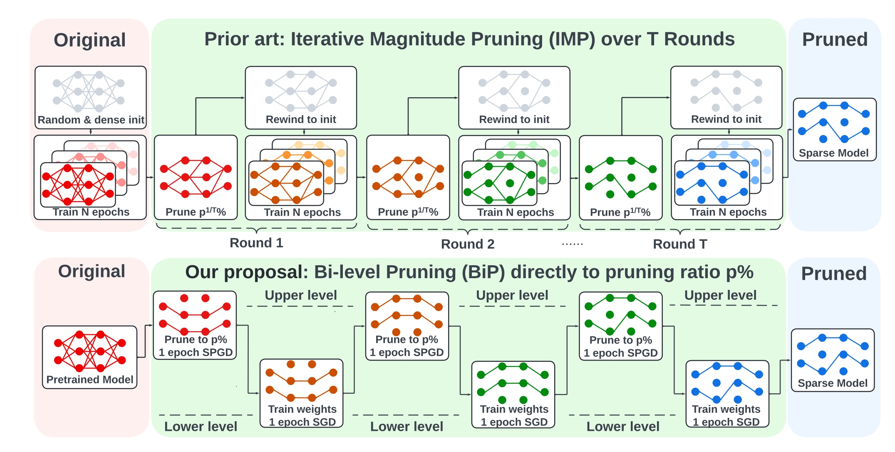

# [Advancing Model Pruning via Bi-level Optimization](https://proceedings.neurips.cc/paper_files/paper/2022/file/749252feedd44f7f10d47ec1d674a2f8-Paper-Conference.pdf)

[code](https://github.com/OPTML-Group/BiP)，[appendix](https://proceedings.neurips.cc/paper_files/paper/2022/file/749252feedd44f7f10d47ec1d674a2f8-Supplemental-Conference.pdf)

## 摘要

作者将剪枝问题抽象为具有双线性(bilinear)约束的Bi-level优化问题，并且通过bilinear推导出$\nabla^2_{m\theta}$可以被一阶导数替代，从而避免二阶求导所带来的复杂开销。

## 动机

1. 将剪枝问题抽象为BLO问题，并发现Bilinear是一种特别的情况->能够有很强的公式算法推导，**整个剪枝权重+mask训练的抽象很新颖**


## 收获和思考

1. 很强的理论推导
2. 比起以往的Iterative Magnitude Pruning，BLO直接一开始就将网络剪枝到目标稀疏度；**BLO其实是一种迭代训练的方法（变种），其中运用的Bi-level优化的理论，感觉这是文章的核心贡献点**



3. **很疑惑的一个点是训练开销的问题：这single-step都有三倍的训练开销了**

```python
switch_to_finetune(model)
# 1st forward
output = model(val_images)
loss = criterion(output, val_targets)
optimizer.zero_grad()
# 1st backward
loss.backward()
optimizer.step()
acc1, acc5 = accuracy(output, val_targets, topk=(1, 5))
losses.update(loss.item(), val_images.size(0))
top1.update(acc1[0], val_images.size(0))
top5.update(acc5[0], val_images.size(0))

switch_to_bilevel(model)
optimizer.zero_grad()
# 2nd forward
output = model(train_images)
loss = criterion(output, train_targets)
# 2nd backward
loss.backward()

def grad2vec(parameters):
    grad_vec = []
    for param in parameters:
        grad_vec.append(param.grad.view(-1).detach())
    return torch.cat(grad_vec)

param_grad_vec = grad2vec(model.parameters())

switch_to_prune(model)
mask_optimizer.zero_grad()
# 3rd forward
loss_mask = criterion(model(train_images), train_targets)
# 3rd backward
loss_mask.backward()
```

## 附加材料

1. [OPTML Group @ Michigan State University](https://www.optml-group.com/)
2. [Yihua Zhang](https://scholar.google.com.hk/citations?user=ui-pcWgAAAAJ&hl=zh-CN)
3. [An introduction to bi-level optimization: Foundations and applications in signal processing and machine learning](https://arxiv.org/abs/2308.00788)
