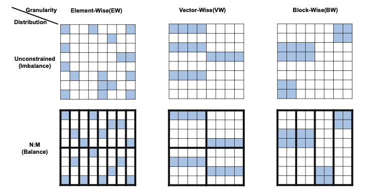
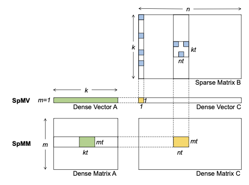

# [Efficient GPU Kernels for N:M-Sparse Weights in Deep Learning](https://proceedings.mlsys.org/paper_files/paper/2023/hash/4552cedd396a308320209f75f56a5ad5-Abstract-mlsys2023.html)

[code](https://github.com/microsoft/SparTA/tree/nmsparse)

## 摘要

作者提出了在**GPU**上实现了为**不同稀疏度的N:M稀疏**加速的算子

## 收获

1. 做AI系统的描述方式和做模型稀疏算法的论文完全不同，更加专业且精准

```text
By exploiting the intrinsic balance characteristic of N:M sparsity, nmSPARSE kernels rearrange irregular computation and scattered memory accesses in sparse matrix multiplication into hardware-aligned regular computation and conflict-free memory accesses at runtime.
```

2. 对不同的N:M稀疏模式的刻画，Element-Wise/Vector-Wise/Block-Wise



3. 了解spmv和spmm的区别



