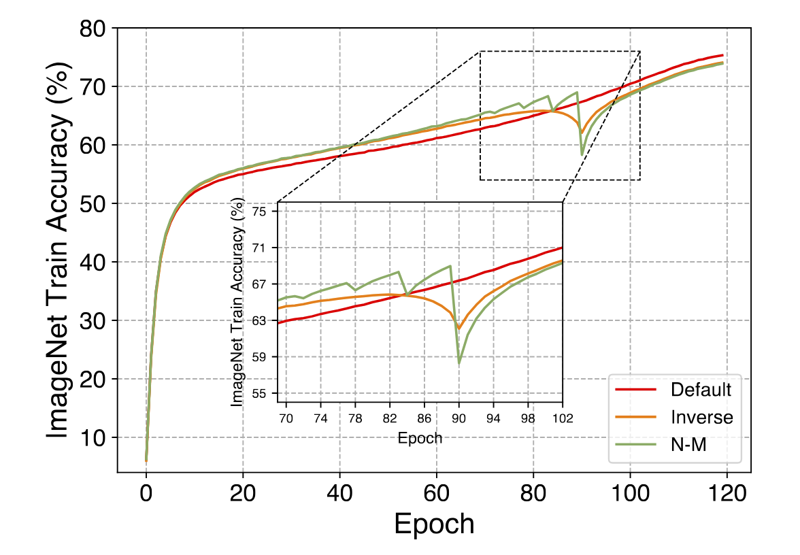

# 均匀剪枝 vs 非均匀剪枝

## 动机

> 本文是一个随记，主要简单介绍均匀剪枝和非均匀剪枝的对比。
> 
> 均匀剪枝到非均匀剪枝是一个非常自然且直觉的过程, 因为DNN的冗余度是随着深度而变化的。
> 从很多的混合精度量化中就可以看到，较深的层往往仅需要较低的bit而浅层的网络往往需要更加高的bit来实现更加更加精细的表示。
> 因此可以有一个很简单的直觉：相较于浅层的网络，深层的网络往往具有更高的冗余度。
> 
> 在剪枝中，均匀剪枝和非均匀剪枝其实也有很长的研究。在经典的研究方向中，非均匀剪枝优于均匀剪枝应该是一种自然的认识。
> 
> 均匀剪枝的研究更为简单，毕竟所有的设计其实都只要基于一个layer来做就可以了，早起比较经典的工作就比如SFP和FPGM，
> 前者专注于提出soft pruning的概念, 允许被prune的通道通过梯度进行更新，回到网络中；
> 后者提出基于几何中心的概念，一种新的重要性判断的criterion。
> 后来出现的渐进式剪枝等各种方式，不论是研究渐进式的方式（比如schedule），还是研究网络prune+regrow的形式，
> 也都是只要关注prune的行为，并不需要关注层之间的关系。
> 
> 非均匀剪枝的研究除了关注层内的行为，核心难点在于关注层与层之间的交互。
> 以最简单的L2剪枝为例，如果应用全局剪枝，每次需要建立一个全局的列表用来存储整个网络权重的通道范数，然后sort+prune(+regrow)等等，
> 整体代码的代码量相较于均匀剪枝就相应增多。
> 更重要的是，这种全局的剪枝对于算法的设计就需要更精细，一旦通道反复横跳，反而可能会增加训练的不稳定性。
>
> 本文想提出的一个问题就是，是否针对所有的剪枝模式，在保证工作优雅的情况下(后面会说), 非均匀剪枝一定优于均匀剪枝?

## 剪枝的中间态

> 这里先从另一个角度认识一下非均匀剪枝：用冗余的部分去适当补偿较不冗余的部分。
> 
> 如果这个行为可以使网络得到增益，那么就可以认为剪枝的分布更为合理。这里有一个词需要注意：适当。这就引出了所谓的“中间态”。
> 如果这个中间态存在于最后的剪枝选择中，当然皆大欢喜；
> 如果这个中间态如果不存在网络中，我们就可以认为冗余的部分补充了较不冗余的部分之后，两者的身份可能发生了互换：不冗余的部分变冗余，冗余的部分变不冗余。
> 此刻我们就需要思考这种行为是否会给网络带来增益？

## 网络性能和剪枝率的变化

> 最近还看到一些工作，很有意思地称剪枝后finetune的过程为：recovery（治愈、复苏、恢复）。
> 私以为这个概念很有意思。
> 结合剪枝率和以往的工作，我们可以说：剪枝率小的网络更容易恢复，而剪枝率大的网络更难恢复。
> 从Pareto曲线上看，模型的性能和剪枝率的关系应当是一条类似于-exp(x)这个类型的曲线，每一个点也就是对应的一个所谓的：中间态。

## 非均匀剪枝>均匀剪枝

> 先说结论，大部分情况下是的，但是并不绝对(在某些配置下并不能看到显著的增益)。这里就给出一个目前直觉上的特例: N:M稀疏。

> 假设给定M=8，那么N:8稀疏化的中间态应该就包括(1:8, 2:8, 4:8和8:8)，相较于传统的剪枝, N:M稀疏化的中间态其实就非常少。
> 这里也就是，所谓的优雅，不要出现很多很多中间态，比如不同channel不同的N:M稀疏或者一个channel也混合不同的稀疏策略。
> 
> 我们先假设我们要寻找一个非均匀稀疏的策略对标2:8稀疏，结合上章中[网络性能和剪枝率的变化](#网络性能和剪枝率的变化)，
> 我们可以知道，从2:8变成1:8和4:8一定是会带来一定的性能损失和性能增益的，这个时候就的确需要衡量两者了。
> 
> 很可惜，结合pareto和目前的实验效果，这份性能损失(2:8->1:8)高于性能增益(2:8->4:8)，混合的N:M稀疏的增益感觉非常有限。

## 中间态的其他表现

> 中间态的另一种表现其实体现在渐进式剪枝的过程:随着剪枝率增大，剪枝率逐步增加的过程。
> 
> 以往的通道剪枝和权重剪枝都可以认为有大量的中间态，因此可以实现较为平滑的剪枝过程。
> 
> 情况在N:M稀疏中就发生了变化，如果从每M个连续权重中看中间态, 中间态只有(M-N-1)个。
> 例如4:4->2:4，中间态只有3:4，也就是随着epoch的增加，模型从4:4逐步变成3:4稀疏最后达成2:4稀疏。
> 在剪枝率较小的情况下，这种非常离散的模式依然可以达成较平滑的过程，因为可以认为网络有较强的治愈能力。
> 但是这里考虑比较极端的情况，1:16稀疏，网络从2:16突变到1:16的情况(图中的N-M)，直觉上就可以知道网络会发现巨大的性能下降，造成训练的不稳定性，这种不稳定性是由于极端的稀疏和离散的中间态所带来的。
> 
> 这也是我们近期的思考一个问题。在近期的工作中，我们给出了针对N:M稀疏的另一个角度的渐进式剪枝策略，将渐进式N:M剪枝的中间态看作是应用N:M稀疏的块数量。
> 假设我们有权重形状为(32, 64, 1, 1)，目标稀疏是2:4，我们就有(32x64//4, 4)->(512, 4)个权重块。
> 我们可以根据权重块应用N:M稀疏的数量作为中间态，最开始512个权重块均为Dense的权重，随着epoch的增加，应用N:M稀疏的权重块逐步增加；
> 
> 在应用N:M稀疏的顺序上，我们首先对L1范数较大的块应用稀疏，区别于以往的剪枝先移除范数较小的权重(图中的Default)。
> 这里的考虑是：
> 在剪枝率小的时候，先给L1范数较大的块应用N:M稀疏并不会导致网络性能的显著损失；
> 在剪枝率较大的情况下，再给范数小的权重块应用稀疏，有助于减少网络剪枝前后的gap，增强训练的稳定。
> 在剪枝率较大的情况下，再给范数大的权重块应用稀疏，网络剪枝前后依然会产生很大的gap，不利于训练的稳定(Inverse)。

## 附加材料
1. [HAQ: Hardware-Aware Automated Quantization with Mixed Precision](https://arxiv.org/pdf/1811.08886.pdf)
2. [Differentiable Dynamic Quantization with Mixed Precision and Adaptive Resolution](https://proceedings.mlr.press/v139/zhang21r/zhang21r.pdf)
3. [Soft Filter Pruning for Accelerating Deep Convolutional Neural Networks](https://arxiv.org/abs/1808.06866)
4. [Filter Pruning via Geometric Median for Deep Convolutional Neural Networks Acceleration](https://arxiv.org/abs/1811.00250)